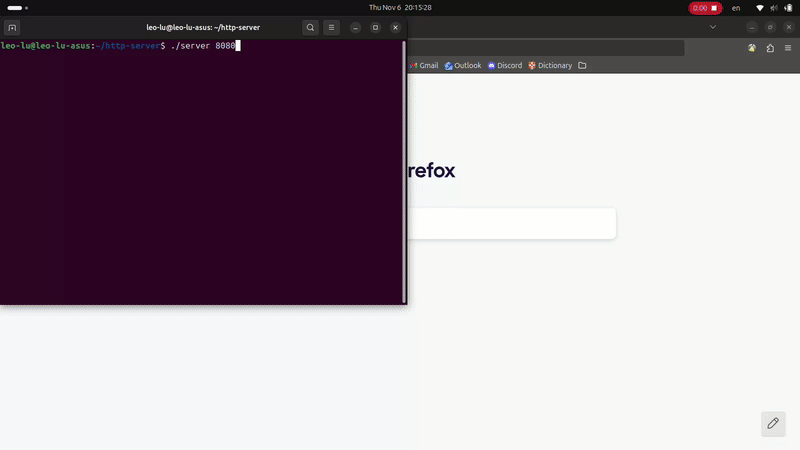

# HTTP Server

A minimal multithreaded **HTTP/1.1 server** in C using a **thread pool** for concurrent request handling.

## Features

-   **Thread Pool:** fixed-size worker threads handle client requests concurrently via a synchronized task queue.
-   **Security:** — prevents directory traversal, validates paths, and restricts served files to the current directory.
-   **Static File Serving:** — serves HTML, CSS, JS, images, audio, video, etc.
-   **HTTP/1.1 Support:** — handles `GET` requests and returns `200`, `403`, `404`, `415`, `501`, `505`.

## Performance

Benchmark using [`wrk`](https://github.com/wg/wrk):

```
wrk -t4 -c100 -d30s http://localhost:8080/index.html
```

| Configuration           | Requests/sec | Transfer/sec | Avg Latency | Notes                         |
| ----------------------- | ------------ | ------------ | ----------- | ----------------------------- |
| **With Thread Pool**    | 34,073       | 10.69 MB/s   | 3.11 ms     | Efficient concurrent handling |
| **Without Thread Pool** | 9,017        | 2.83 MB/s    | 10.13 ms    | Sequential, slower under load |

✅ **Result:** The thread pool version achieves **~3.8× higher throughput** and significantly lower latency under high concurrency.

## Run

```
make
./server <port>
```

## Demo


